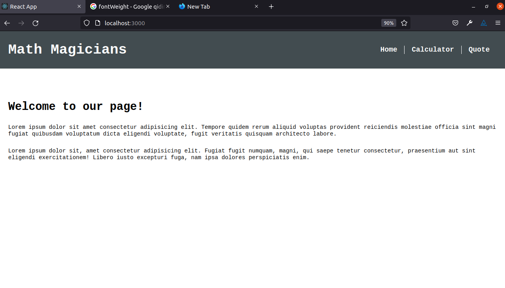

# Math Magicians

> Simple app to carry out basic arithmetic operations.

Math Magicians is a SPApp for carrying out basic mathematical operations built with React.

## Built With

- HTML/CSS, JS
- React
- Gitflow

## Live Demo

[Live Demo Link](https://livedemo.com)

## Getting Started

To get a local copy up and running follow these simple example steps.

### Prerequisites
- Please make sure you have Node.js installed on your machine

### Setup

To setup the Math Magicians project in your local, in the repo page:
click on code (dropdown list) > Download as ZIP;
or open terminal of path you want to install project and run this command  
`git clone https://github.com/Hope1226/math-magicians-app.git`.

### Install

Run in your terminal the following commands:

**`$ cd Math-Magicians/`** 
**`$ npm install`** 
**`$ npm start`**

## Authors

👤 **Umidjon Ustabaev (Hope)**

- GitHub: [@Hope1226](https://github.com/Hope1226)
- LinkedIn: [@UmidjonUstabaev](https://www.linkedin.com/in/umidjon-ustabaev-03b92b11a/)

## 🤝 Contributing

Contributions, issues, and feature requests are welcome!

Feel free to check the [issues page](../../issues/).

## Show your support

Give a ⭐️ if you like this project!

## Acknowledgments

- Hat tip to anyone whose code was used
- Inspiration
- etc

## 📝 License

This project is [MIT](./MIT.md) licensed.